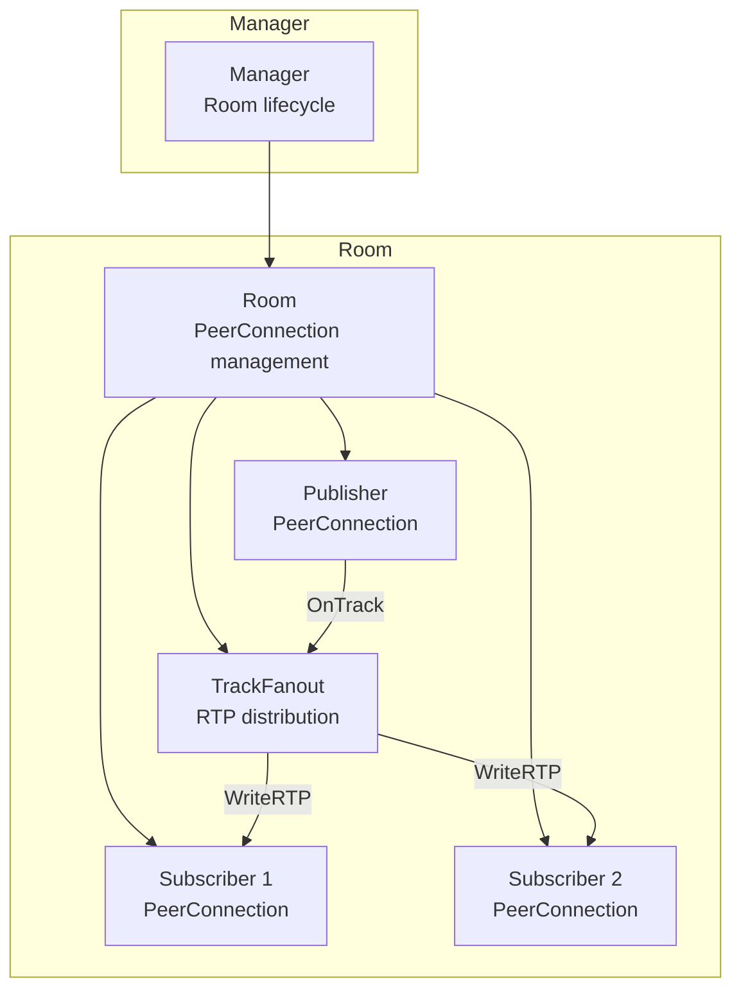
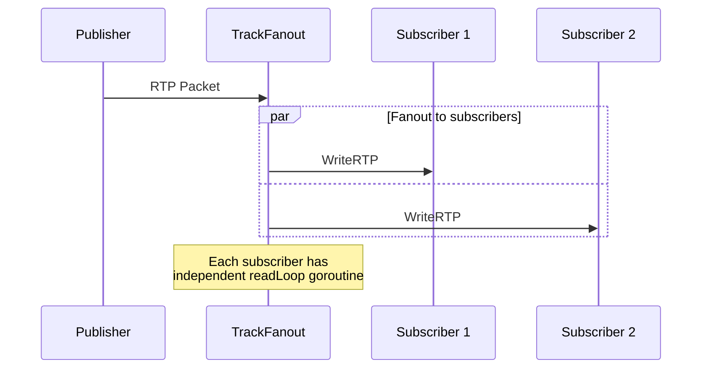

# ADR-0001: Core SFU Architecture

**Status**: Approved
**Date**: 2024
**Decision Makers**: Core team

## Context

Go-Live needs a clear architectural model for managing WebRTC connections, room state, and media forwarding. The architecture must be simple enough for a single developer to understand and maintain, while being performant enough for production live streaming.

## Decision

Adopt a three-tier hierarchy: **Manager → Room → TrackFanout**.

### Manager (`internal/sfu/manager.go`)
- Owns the room registry (`map[string]*Room`)
- Creates rooms on first publish
- Cleans up empty rooms (no publisher, no subscribers)
- Thread-safe with `sync.RWMutex`

### Room (`internal/sfu/room.go`)
- Manages one publisher and N subscribers
- Holds `sync.RWMutex` for state protection
- Handles SDP exchange and ICE lifecycle
- Coordinates recording start/stop

### TrackFanout (`internal/sfu/track.go`)
- One per media track (audio, video)
- Reads RTP from publisher's remote track
- Writes RTP to each subscriber's local track
- Independent goroutine per subscriber (`readLoop`)

## Concurrency Model

**Goroutine lifecycle:**
- `readLoop` goroutine created when subscriber attaches to track
- Exits on: subscriber disconnect, publisher disconnect, room close
- No goroutine leaks: all exits are signaled via channel or context cancellation

**Room state protection:**
- Read operations (list subscribers, check state): `RLock()`
- Write operations (add/remove subscriber, close): `Lock()`
- TrackFanout operations are lock-free (each goroutine owns its subscriber)

## Alternatives Considered

### MCU (Multipoint Control Unit)
- **Rejected**: Decodes and re-encodes all streams
- High CPU cost, codec licensing concerns
- SFU forward-only model is simpler and more efficient

### Database-backed room persistence
- **Rejected**: Adds operational complexity
- In-memory is sufficient for live streaming (rooms are ephemeral)
- Could be added later if session persistence is needed

### Actor model (goroutine per room)
- **Considered**: Would eliminate mutex contention
- **Rejected**: Adds complexity for marginal benefit at current scale
- Mutex model is well-understood and debuggable

## Consequences

- Simple, debuggable architecture
- Single binary deployment
- Room state is ephemeral (lost on restart)
- Single publisher per room (no multi-party conferencing)
