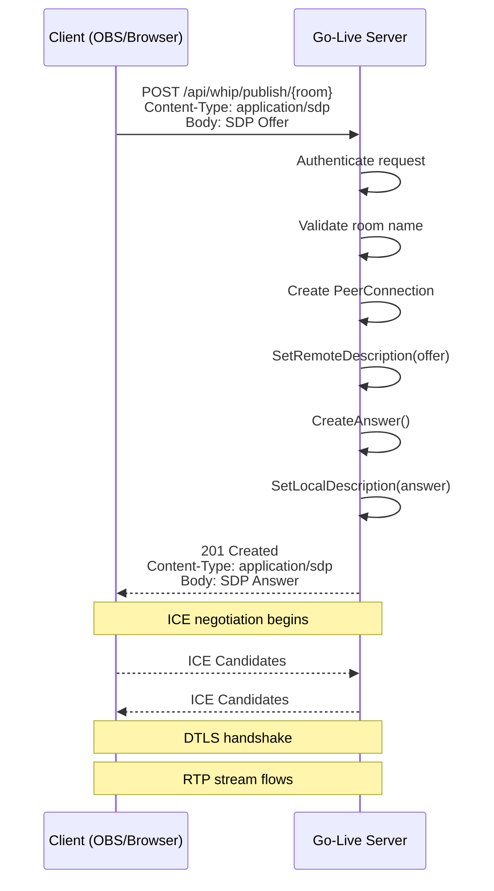
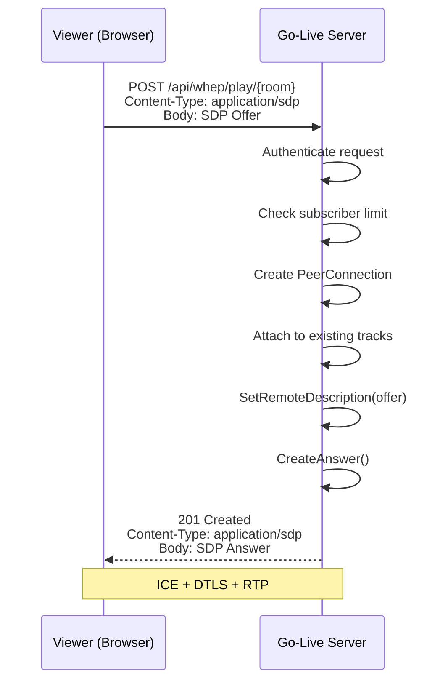
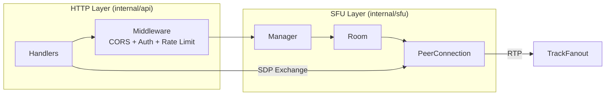

# ADR-0002: WHIP/WHEP Protocol Integration

**Status**: Approved
**Date**: 2024
**Decision Makers**: Core team

## Context

Go-Live needs a signaling protocol for WebRTC stream publishing and playback. The signaling mechanism determines how clients establish connections with the server.

## Decision

Adopt WHIP (WebRTC-HTTP Ingestion Protocol) for publishing and WHEP (WebRTC-HTTP Egress Protocol) for playback.

### WHIP Publishing Flow

### WHEP Playback Flow

### API Contract

| Method | Path | Request | Response |
|--------|------|---------|----------|
| `POST` | `/api/whip/publish/{room}` | SDP Offer | SDP Answer (201) |
| `POST` | `/api/whep/play/{room}` | SDP Offer | SDP Answer (201) |

Both endpoints accept `application/sdp` content type and return `application/sdp` in the response body.

## Rationale

### Why WHIP/WHEP over WebSocket signaling

| Aspect | WHIP/WHEP | WebSocket |
|--------|-----------|-----------|
| Infrastructure | Standard HTTP | Requires WebSocket support |
| CDN/Proxy | Works with any reverse proxy | Needs WebSocket-aware proxy |
| Client complexity | Simple POST request | Persistent connection management |
| Firewall traversal | HTTP(S) is universally allowed | May be blocked |
| Scaling | Stateless HTTP, easy to scale | Stateful connections |

### Why WHIP/WHEP over custom protocol

- **Interoperability**: OBS Studio, browsers, and libraries support WHIP/WHEP
- **Standards-track**: IETF drafts with growing adoption
- **Simplicity**: One HTTP request per connection (no trickle ICE in basic mode)

## Integration Architecture

## Alternatives Considered

### WebSocket-based signaling
- **Rejected**: Adds infrastructure complexity
- Clients must maintain persistent connections
- Harder to scale horizontally

### gRPC-based signaling
- **Rejected**: Not natively supported in browsers
- Requires gRPC-Web proxy layer

### Custom HTTP API
- **Rejected**: Would work but loses interoperability
- WHIP/WHEP are becoming the standard

## Consequences

- Simple HTTP-based signaling
- Compatible with OBS Studio and modern browsers
- No WebSocket infrastructure needed
- Basic mode does not support trickle ICE (all candidates in SDP)
