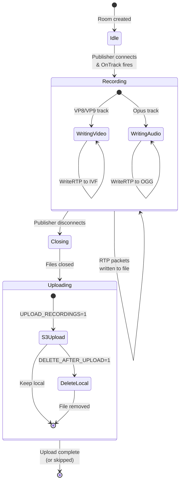

# ADR-0003: Recording Design

**Status**: Approved
**Date**: 2024
**Decision Makers**: Core team

## Context

Go-Live needs a recording mechanism to capture live streams for later playback. The recording system must work within the SFU's zero-transcoding constraint: media is forwarded as-is, not decoded and re-encoded.

## Decision

Record raw RTP payloads into container formats that support them directly:

| Codec | Container | File Extension |
|-------|-----------|----------------|
| VP8 | IVF | `.ivf` |
| VP9 | IVF | `.ivf` |
| Opus | OGG | `.ogg` |

### Recording Lifecycle



### File Naming

```
{roomName}_{trackID}_{timestamp}.{ext}
```

Example: `livestream_video_1715000000.ivf`

### Storage Options

1. **Local filesystem** (default): Write to `RECORD_DIR`
2. **S3/MinIO upload**: When `UPLOAD_RECORDINGS=1`, upload after publisher disconnects

## Rationale

### Why IVF/OGG over MP4/WebM

| Format | Transcoding Required | Container Complexity |
|--------|---------------------|---------------------|
| IVF (VP8/VP9) | No | Minimal header + raw frames |
| OGG (Opus) | No | Simple page structure |
| MP4 (H.264) | Yes (needs SPS/PPS extraction) | Complex box structure |
| WebM | Partial | Matroska container, moderate complexity |

IVF and OGG are the simplest containers that can hold VP8/VP9 and Opus respectively without any media processing. This aligns with the zero-transcoding principle.

### Why upload on disconnect (not streaming)

- Simpler implementation (no multipart upload management)
- Files are complete and valid before upload
- Reduces S3 API calls (one PUT per recording)
- Trade-off: Large recordings use more local disk temporarily

## Configuration

| Variable | Default | Description |
|----------|---------|-------------|
| `RECORD_ENABLED` | `0` | Enable recording (`1` to enable) |
| `RECORD_DIR` | `records` | Local output directory |
| `UPLOAD_RECORDINGS` | `0` | Enable S3 upload |
| `DELETE_RECORDING_AFTER_UPLOAD` | `0` | Remove local file after upload |
| `S3_*` | - | S3/MinIO connection configuration |

## Alternatives Considered

### Streaming upload to S3
- **Rejected**: Multipart upload complexity
- Would need chunk management and retry logic
- Local-first approach is simpler and more reliable

### Server-side transcoding to MP4
- **Rejected**: Violates zero-transcoding principle
- High CPU cost, codec licensing
- Clients can post-process IVF/OGG to MP4 if needed

### Database metadata for recordings
- **Considered**: Would enable search and management APIs
- **Rejected**: File listing from `RECORD_DIR` is sufficient for current scope
- Could be added later for admin UI

## Consequences

- Simple recording with no media processing overhead
- IVF/OGG files need client-side conversion for universal playback
- Local disk usage during recording (before upload)
- Recording stops when publisher disconnects (no gap filling)
