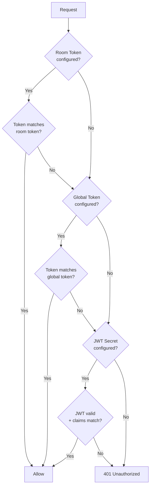

# Security Architecture

Go-Live implements defense-in-depth security across authentication, input validation, transport protection, and rate limiting. This document describes the threat model, security mechanisms, and test coverage.

## Threat Model

| Threat | Mitigation |
|--------|------------|
| Unauthorized stream access | Multi-layer authentication (Token, JWT) |
| Room hijacking | Room name validation + per-room tokens |
| Denial of service | Per-IP rate limiting + payload size limits |
| Credential leakage | Constant-time token comparison + no secrets in error responses |
| Path traversal | Room name regex: `^[A-Za-z0-9_-]{1,64}$` |
| XSS via room names | Input sanitization (alphanumeric + hyphen/underscore only) |
| Timing attacks | `crypto/subtle.ConstantTimeCompare` for all token comparisons |

## Authentication Layers

Go-Live supports three authentication methods, checked in priority order:

### Token Authentication

- **Global token** (`AUTH_TOKEN`): Single shared secret for all rooms
- **Per-room tokens** (`ROOM_TOKENS`): `room1:token1;room2:token2` format
- Room tokens take priority over global tokens
- Delivered via `Authorization: Bearer <token>` or `X-Auth-Token` header

### JWT Authentication

- HMAC-SHA256 signed tokens (`JWT_SECRET`)
- Audience validation (`JWT_AUDIENCE`)
- Expiry validation (`exp` claim)
- Room restriction via `room` claim in JWT payload

### Admin Authentication

- Separate admin token (`ADMIN_TOKEN`) for administrative endpoints
- Required for room closure and recording management

## Input Validation

### Room Names

Enforced by regex `^[A-Za-z0-9_-]{1,64}$`:

| Input | Result | Reason |
|-------|--------|--------|
| `my-room` | Valid | Alphanumeric + hyphen |
| `test_room_1` | Valid | Alphanumeric + underscore |
| `../../../etc/passwd` | Rejected | Path traversal attempt |
| `room/../../config` | Rejected | Path separator |
| `` | Rejected | XSS attempt |
| `bad room` | Rejected | Space character |

### SDP Payload

- Maximum size: 1MB (`http.MaxBytesReader`)
- Returns HTTP 413 (Request Entity Too Large) on overflow
- Prevents payload bombing attacks

## CORS Protection

- Origin whitelist via `ALLOWED_ORIGIN` environment variable
- Preflight (`OPTIONS`) requests validated against whitelist
- Disallowed origins receive no CORS headers (not `*`)
- Default: `*` (allows all origins — configure for production)

## Rate Limiting

Per-IP token bucket algorithm:

| Configuration | Default | Description |
|---------------|---------|-------------|
| `RATE_LIMIT_RPS` | `0` (disabled) | Requests per second per IP |
| `RATE_LIMIT_BURST` | `0` | Maximum burst size |

When enabled, the rate limiter:
1. Extracts client IP from request
2. Checks token bucket availability
3. Allows request and decrements bucket, or returns HTTP 429
4. Bucket refills at configured RPS rate

## Security Test Coverage

| Test | What It Verifies |
|------|------------------|
| `TestSecurityAuthenticationBypass` | No auth header, wrong token, wrong bearer → 401 |
| `TestSecurityRoomTokenAuthentication` | Room token overrides global token |
| `TestSecurityJWTAuthentication` | Invalid JWT rejected, valid JWT accepted |
| `TestSecurityAdminAuthentication` | Admin endpoints require admin token |
| `TestSecurityRateLimiting` | Burst passes, excess is limited |
| `TestSecurityCORSProtection` | Allowed origin gets CORS headers, disallowed does not |
| `TestSecurityInputValidation` | Path traversal, XSS, spaces rejected |
| `TestSecurityLargePayload` | Oversized SDP → 413 |
| `TestSecuritySensitiveDataExposure` | No passwords/secrets in error responses |

## Best Practices for Production

1. **Always configure authentication**: Set `AUTH_TOKEN` or `JWT_SECRET` for any public deployment
2. **Use per-room tokens**: Isolate access between rooms using `ROOM_TOKENS`
3. **Restrict CORS origin**: Set `ALLOWED_ORIGIN` to your domain(s), not `*`
4. **Enable rate limiting**: Set `RATE_LIMIT_RPS` to prevent abuse
5. **Use HTTPS**: Deploy behind a TLS-terminating reverse proxy
6. **Rotate tokens**: Change tokens periodically; JWT supports expiry via `exp` claim
7. **Monitor metrics**: Watch `/metrics` for rate limit rejections and auth failures
