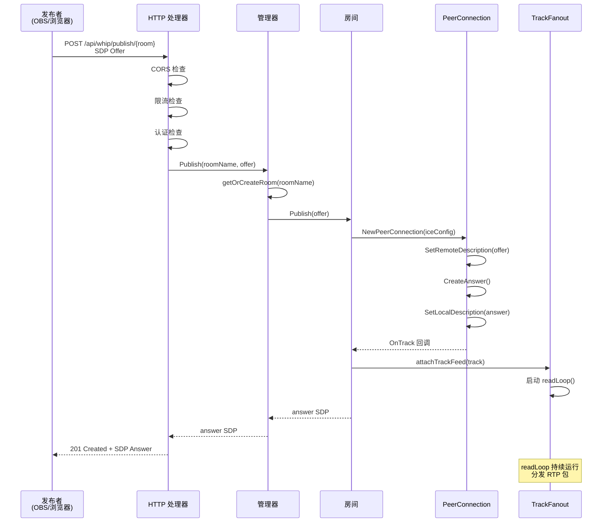
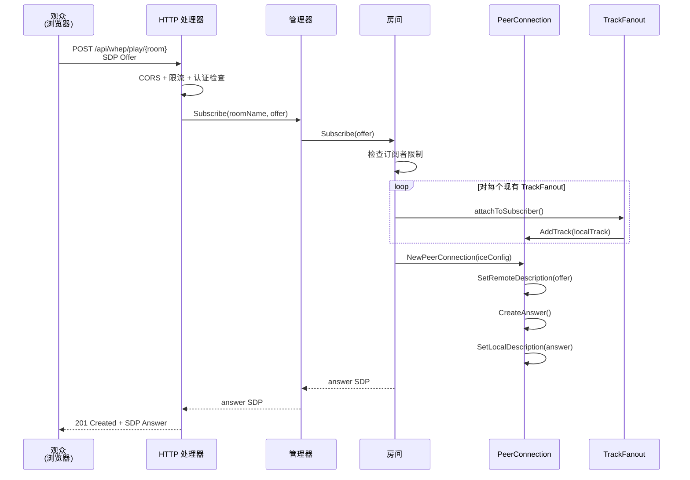
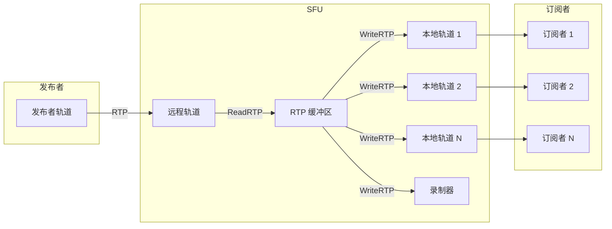
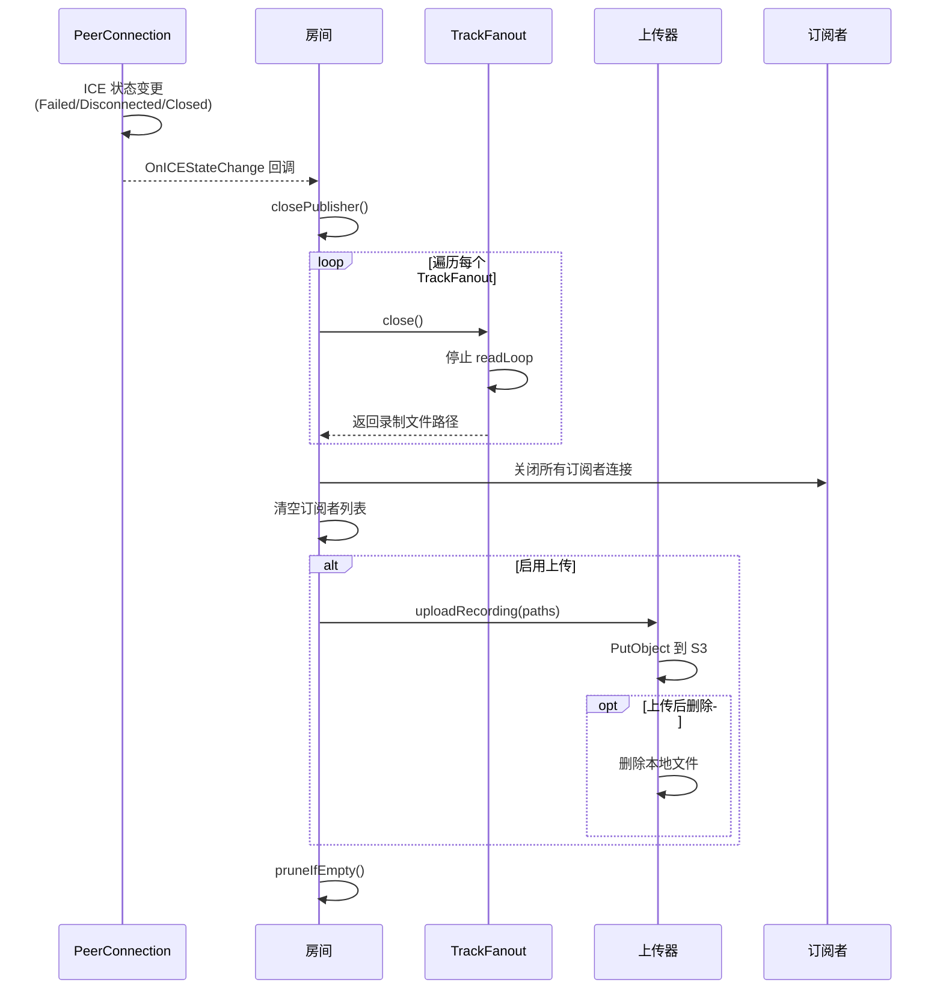
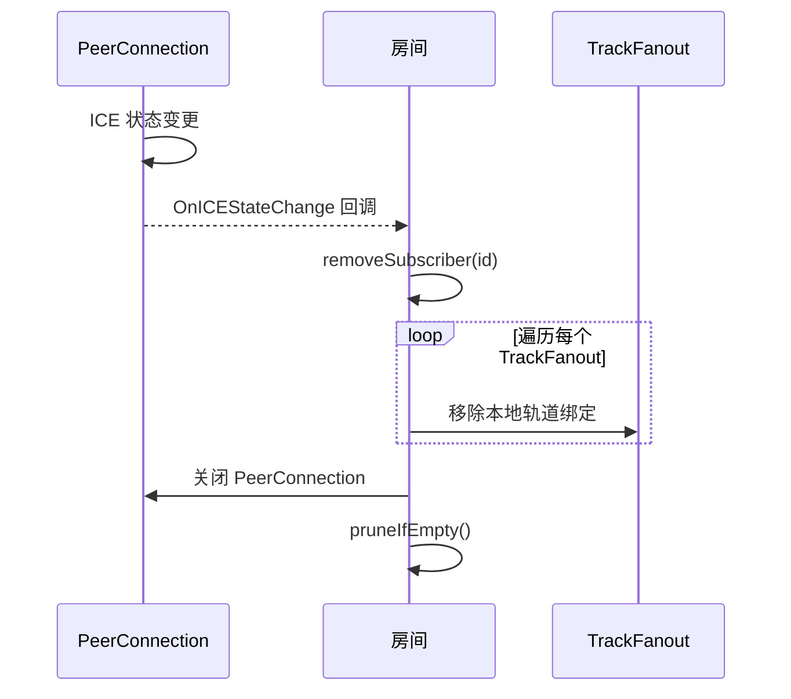
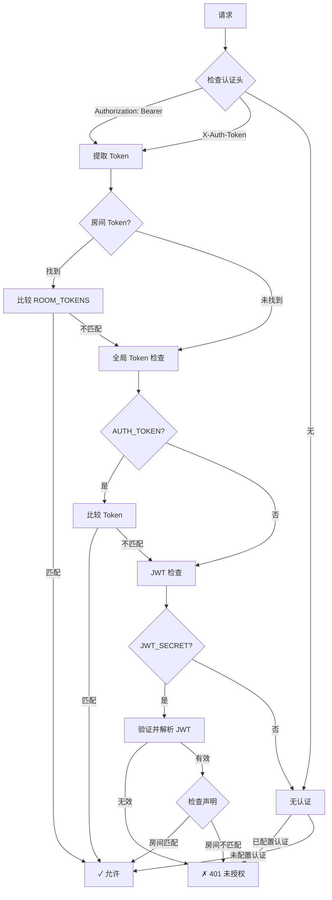
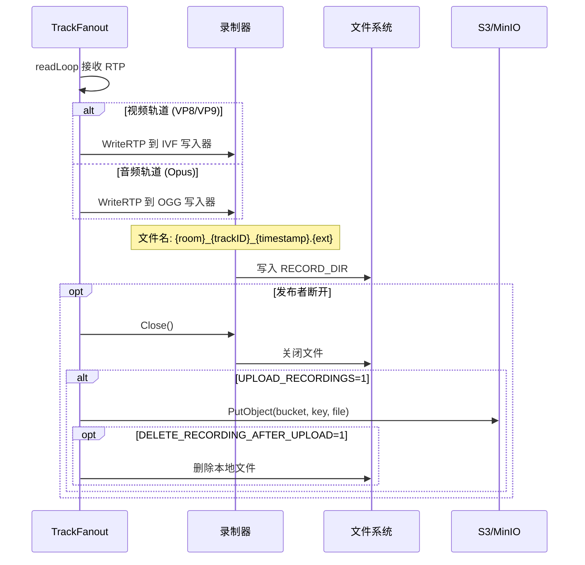

# 数据流

请求和数据流的详细文档。

## WHIP 发布流程



## WHEP 播放流程



## RTP 包转发流程



## 断开连接流程

### 发布者断开



### 订阅者断开



## 认证流程



## 录制流程



## 指标更新流程

```mermaid
flowchart TB
    subgraph RTP["RTP 处理"]
        READ[ReadRTP] --> UPDATE[更新指标]
        UPDATE --> DISTRIB[分发给订阅者]
    end

    subgraph Metrics["Prometheus 指标"]
        UPDATE --> ROOMS[live_rooms Gauge]
        UPDATE --> SUBS[live_subscribers GaugeVec]
        UPDATE --> BYTES[live_rtp_bytes_total CounterVec]
        UPDATE --> PKTS[live_rtp_packets_total CounterVec]
    end

    subgraph Export["导出"]
        ROOMS --> PROM[/metrics 端点]
        SUBS --> PROM
        BYTES --> PROM
        PKTS --> PROM
    end
```

## 请求限流

```mermaid
flowchart TB
    REQ[请求] --> IP[提取客户端 IP]
    IP --> BUCKET{令牌桶<br/>可用?}

    BUCKET -->|是| ALLOW[允许请求]
    BUCKET -->|否| REJECT[429 Too Many Requests]

    ALLOW --> PROCESS[处理请求]
    PROCESS --> UPDATE[更新令牌桶<br/>-1 令牌]

    Note over BUCKET: 按 RATE_LIMIT_RPS 速率补充<br/>突发容量: RATE_LIMIT_BURST
```
