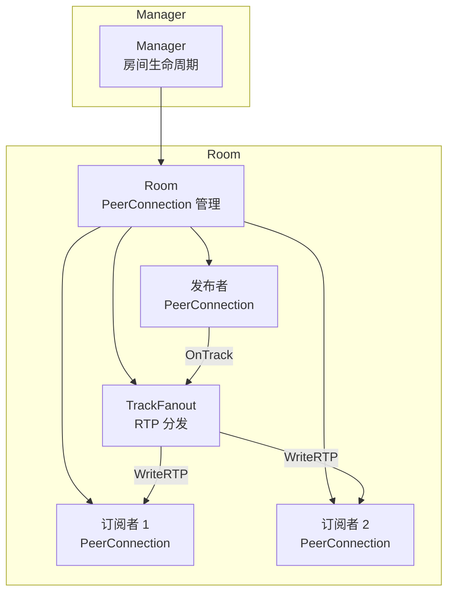
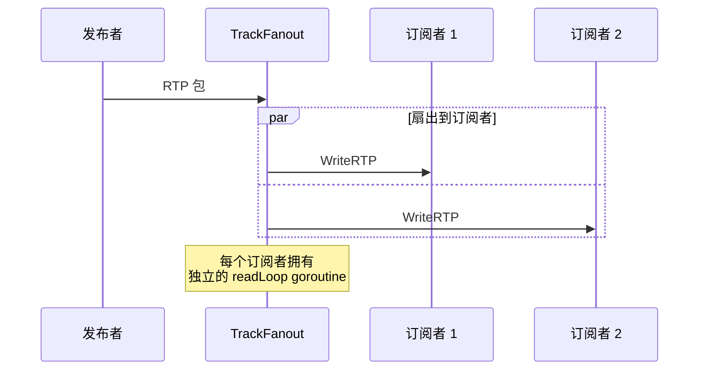

# ADR-0001: 核心 SFU 架构

**状态**：已批准
**日期**：2024
**决策者**：核心团队

## 背景

Go-Live 需要一个清晰的架构模型来管理 WebRTC 连接、房间状态和媒体转发。架构必须足够简单，让单个开发者能够理解和维护，同时在生产直播场景中具备足够性能。

## 决策

采用三层层级结构：**Manager → Room → TrackFanout**。

### Manager（`internal/sfu/manager.go`）
- 拥有房间注册表（`map[string]*Room`）
- 首次发布时创建房间
- 清理空房间（无发布者、无订阅者）
- 使用 `sync.RWMutex` 保证线程安全

### Room（`internal/sfu/room.go`）
- 管理一个发布者和 N 个订阅者
- 持有 `sync.RWMutex` 保护状态
- 处理 SDP 交换和 ICE 生命周期
- 协调录制的开始/停止

### TrackFanout（`internal/sfu/track.go`）
- 每个媒体轨道一个（音频、视频）
- 从发布者远程轨道读取 RTP
- 写入每个订阅者的本地轨道
- 每个订阅者独立 goroutine（`readLoop`）

## 并发模型

**Goroutine 生命周期：**
- 订阅者附加到轨道时创建 `readLoop` goroutine
- 退出条件：订阅者断开、发布者断开、房间关闭
- 无 goroutine 泄漏：所有退出通过 channel 或 context 取消信号

**房间状态保护：**
- 读操作（列出订阅者、检查状态）：`RLock()`
- 写操作（添加/移除订阅者、关闭）：`Lock()`
- TrackFanout 操作无锁（每个 goroutine 拥有自己的订阅者）

## 考虑的替代方案

### MCU（多点控制单元）
- **拒绝**：需要解码和重编码所有流
- 高 CPU 开销，编解码器许可问题
- SFU 直通模型更简单更高效

### 数据库支持的房间持久化
- **拒绝**：增加运维复杂性
- 内存方案对直播场景足够（房间是临时的）
- 如需会话持久化可后续添加

### Actor 模型（每房间一个 goroutine）
- **考虑过**：可消除 mutex 竞争
- **拒绝**：在当前规模下增加复杂性收益有限
- mutex 模型易于理解和调试

## 结果

- 简单、可调试的架构
- 单二进制部署
- 房间状态临时（重启时丢失）
- 每房间单发布者（不支持多方会议）
