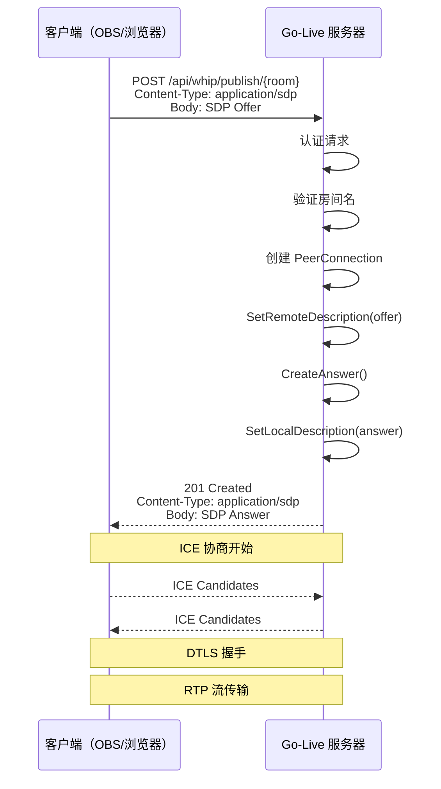
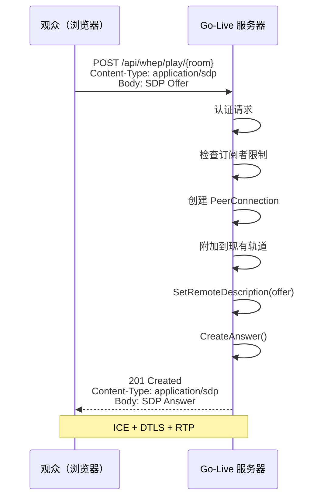
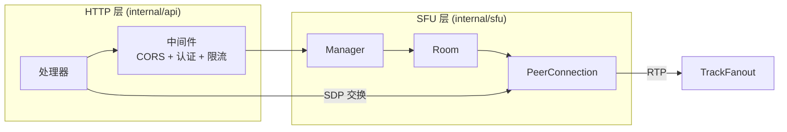

# ADR-0002: WHIP/WHEP 协议集成

**状态**：已批准
**日期**：2024
**决策者**：核心团队

## 背景

Go-Live 需要一个信令协议用于 WebRTC 流的发布和播放。信令机制决定了客户端如何与服务器建立连接。

## 决策

采用 WHIP（WebRTC-HTTP Ingestion Protocol）用于发布，WHEP（WebRTC-HTTP Egress Protocol）用于播放。

### WHIP 发布流程

### WHEP 播放流程

### API 契约

| 方法 | 路径 | 请求 | 响应 |
|------|------|------|------|
| `POST` | `/api/whip/publish/{room}` | SDP Offer | SDP Answer (201) |
| `POST` | `/api/whep/play/{room}` | SDP Offer | SDP Answer (201) |

两个端点接受 `application/sdp` 内容类型，响应体返回 `application/sdp`。

## 理由

### 为什么选择 WHIP/WHEP 而非 WebSocket 信令

| 方面 | WHIP/WHEP | WebSocket |
|------|-----------|-----------|
| 基础设施 | 标准 HTTP | 需要 WebSocket 支持 |
| CDN/代理 | 兼容任何反向代理 | 需要 WebSocket 感知代理 |
| 客户端复杂性 | 简单 POST 请求 | 持久连接管理 |
| 防火墙穿透 | HTTP(S) 通用放行 | 可能被阻断 |
| 扩展性 | 无状态 HTTP，易于扩展 | 有状态连接 |

### 为什么选择 WHIP/WHEP 而非自定义协议

- **互操作性**：OBS Studio、浏览器和库支持 WHIP/WHEP
- **标准轨道**：IETF 草案，采用率不断增长
- **简洁性**：每个连接一个 HTTP 请求（基础模式无 trickle ICE）

## 集成架构

## 考虑的替代方案

### 基于 WebSocket 的信令
- **拒绝**：增加基础设施复杂性
- 客户端必须维护持久连接
- 更难水平扩展

### 基于 gRPC 的信令
- **拒绝**：浏览器不原生支持
- 需要 gRPC-Web 代理层

### 自定义 HTTP API
- **拒绝**：可行但失去互操作性
- WHIP/WHEP 正在成为标准

## 结果

- 简单的基于 HTTP 的信令
- 兼容 OBS Studio 和现代浏览器
- 无需 WebSocket 基础设施
- 基础模式不支持 trickle ICE（所有候选在 SDP 中）
