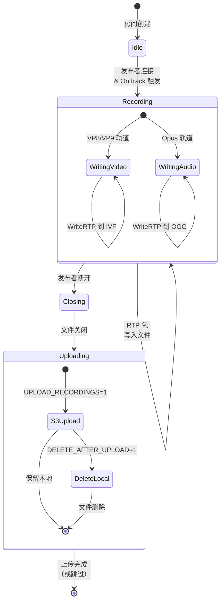

# ADR-0003: 录制设计

**状态**：已批准
**日期**：2024
**决策者**：核心团队

## 背景

Go-Live 需要一个录制机制来捕获直播流以供后续播放。录制系统必须在 SFU 的零转码约束内工作：媒体按原样转发，不解码也不重编码。

## 决策

将原始 RTP 载荷录制到直接支持它们的容器格式：

| 编解码器 | 容器 | 文件扩展名 |
|----------|------|-----------|
| VP8 | IVF | `.ivf` |
| VP9 | IVF | `.ivf` |
| Opus | OGG | `.ogg` |

### 录制生命周期



### 文件命名

```
{roomName}_{trackID}_{timestamp}.{ext}
```

示例：`livestream_video_1715000000.ivf`

### 存储选项

1. **本地文件系统**（默认）：写入 `RECORD_DIR`
2. **S3/MinIO 上传**：`UPLOAD_RECORDINGS=1` 时，发布者断开后上传

## 理由

### 为什么选择 IVF/OGG 而非 MP4/WebM

| 格式 | 是否需要转码 | 容器复杂度 |
|------|-------------|-----------|
| IVF（VP8/VP9） | 否 | 最小头 + 原始帧 |
| OGG（Opus） | 否 | 简单页面结构 |
| MP4（H.264） | 是（需要 SPS/PPS 提取） | 复杂 box 结构 |
| WebM | 部分 | Matroska 容器，中等复杂度 |

IVF 和 OGG 是能直接容纳 VP8/VP9 和 Opus 的最简单容器，无需任何媒体处理。这与零转码原则一致。

### 为什么在断开时上传（而非流式上传）

- 实现更简单（无分片上传管理）
- 文件在上传前完整且有效
- 减少 S3 API 调用（每次录制一次 PUT）
- 权衡：大录制文件会临时占用更多本地磁盘

## 配置

| 变量 | 默认值 | 描述 |
|------|--------|------|
| `RECORD_ENABLED` | `0` | 启用录制（`1` 启用） |
| `RECORD_DIR` | `records` | 本地输出目录 |
| `UPLOAD_RECORDINGS` | `0` | 启用 S3 上传 |
| `DELETE_RECORDING_AFTER_UPLOAD` | `0` | 上传后删除本地文件 |
| `S3_*` | - | S3/MinIO 连接配置 |

## 考虑的替代方案

### 流式上传到 S3
- **拒绝**：分片上传复杂性
- 需要分块管理和重试逻辑
- 本地优先方案更简单更可靠

### 服务端转码为 MP4
- **拒绝**：违反零转码原则
- 高 CPU 开销，编解码器许可问题
- 客户端可在需要时将 IVF/OGG 后处理为 MP4

### 录制元数据数据库
- **考虑过**：可支持搜索和管理 API
- **拒绝**：从 `RECORD_DIR` 列出文件对当前范围足够
- 后续可为管理 UI 添加

## 结果

- 简单录制，无媒体处理开销
- IVF/OGG 文件需要客户端转换以实现通用播放
- 录制期间使用本地磁盘（上传前）
- 发布者断开时录制停止（无间隙填充）
