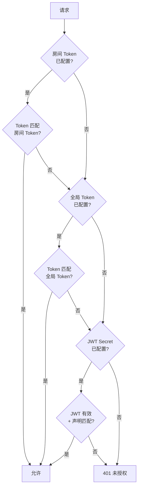

# 安全架构

Go-Live 在认证、输入验证、传输保护和限流方面实现了纵深防御。本文档描述威胁模型、安全机制和测试覆盖。

## 威胁模型

| 威胁 | 缓解措施 |
|------|----------|
| 未授权流访问 | 多层认证（Token、JWT） |
| 房间劫持 | 房间名验证 + 房间级 Token |
| 拒绝服务 | 每 IP 限流 + 载荷大小限制 |
| 凭据泄漏 | 常量时间 Token 比较 + 错误响应不含密钥 |
| 路径遍历 | 房间名正则：`^[A-Za-z0-9_-]{1,64}$` |
| XSS（通过房间名） | 输入清理（仅字母数字 + 连字符/下划线） |
| 时序攻击 | 所有 Token 比较使用 `crypto/subtle.ConstantTimeCompare` |

## 认证层

Go-Live 支持三种认证方式，按优先级检查：

### Token 认证

- **全局 Token**（`AUTH_TOKEN`）：所有房间共享的单一密钥
- **房间级 Token**（`ROOM_TOKENS`）：格式 `room1:token1;room2:token2`
- 房间 Token 优先于全局 Token
- 通过 `Authorization: Bearer <token>` 或 `X-Auth-Token` 头传递

### JWT 认证

- HMAC-SHA256 签名令牌（`JWT_SECRET`）
- 受众验证（`JWT_AUDIENCE`）
- 过期验证（`exp` 声明）
- 通过 JWT 载荷中的 `room` 声明限制房间访问

### 管理员认证

- 独立管理员 Token（`ADMIN_TOKEN`）用于管理端点
- 房间关闭和录制管理需要管理员权限

## 输入验证

### 房间名

由正则 `^[A-Za-z0-9_-]{1,64}$` 强制：

| 输入 | 结果 | 原因 |
|------|------|------|
| `my-room` | 有效 | 字母数字 + 连字符 |
| `test_room_1` | 有效 | 字母数字 + 下划线 |
| `../../../etc/passwd` | 拒绝 | 路径遍历尝试 |
| `room/../../config` | 拒绝 | 路径分隔符 |
| `` | 拒绝 | XSS 尝试 |
| `bad room` | 拒绝 | 空格字符 |

### SDP 载荷

- 最大大小：1MB（`http.MaxBytesReader`）
- 超出时返回 HTTP 413（请求实体过大）
- 防止载荷炸弹攻击

## CORS 保护

- 通过 `ALLOWED_ORIGIN` 环境变量配置源白名单
- 预检（`OPTIONS`）请求对白名单验证
- 不允许的源不接收 CORS 头（非 `*`）
- 默认：`*`（允许所有源 — 生产环境请配置）

## 限流

每 IP 令牌桶算法：

| 配置 | 默认值 | 描述 |
|------|--------|------|
| `RATE_LIMIT_RPS` | `0`（禁用） | 每 IP 每秒请求数 |
| `RATE_LIMIT_BURST` | `0` | 最大突发大小 |

启用后，限流器：
1. 从请求中提取客户端 IP
2. 检查令牌桶可用性
3. 允许请求并递减桶，或返回 HTTP 429
4. 桶按配置的 RPS 速率补充

## 安全测试覆盖

| 测试 | 验证内容 |
|------|----------|
| `TestSecurityAuthenticationBypass` | 无认证头、错误 Token、错误 Bearer → 401 |
| `TestSecurityRoomTokenAuthentication` | 房间 Token 覆盖全局 Token |
| `TestSecurityJWTAuthentication` | 无效 JWT 拒绝，有效 JWT 接受 |
| `TestSecurityAdminAuthentication` | 管理端点需要管理员 Token |
| `TestSecurityRateLimiting` | 突发通过，超出被限流 |
| `TestSecurityCORSProtection` | 允许的源获得 CORS 头，不允许的没有 |
| `TestSecurityInputValidation` | 路径遍历、XSS、空格被拒绝 |
| `TestSecurityLargePayload` | 超大 SDP → 413 |
| `TestSecuritySensitiveDataExposure` | 错误响应中无密码/密钥 |

## 生产环境最佳实践

1. **始终配置认证**：任何公共部署都设置 `AUTH_TOKEN` 或 `JWT_SECRET`
2. **使用房间级 Token**：通过 `ROOM_TOKENS` 隔离房间访问
3. **限制 CORS 源**：将 `ALLOWED_ORIGIN` 设置为你的域名，而非 `*`
4. **启用限流**：设置 `RATE_LIMIT_RPS` 防止滥用
5. **使用 HTTPS**：部署在 TLS 终止反向代理后面
6. **轮换 Token**：定期更换 Token；JWT 通过 `exp` 声明支持过期
7. **监控指标**：查看 `/metrics` 中的限流拒绝和认证失败
